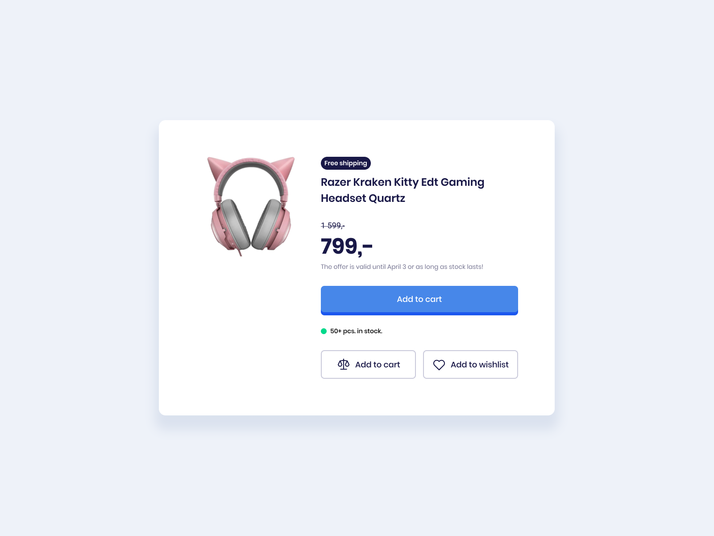
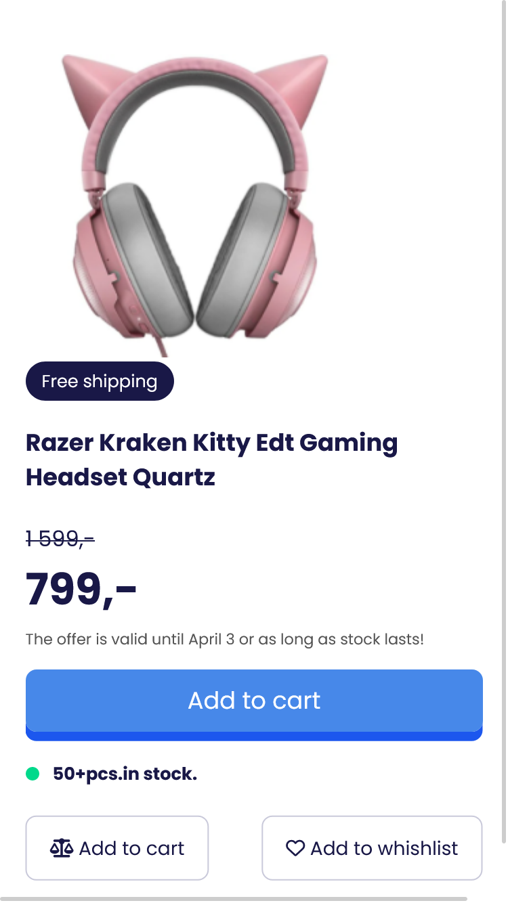

# Listado de retos

  
<strong>Reto día 1</strong>

    

  
<strong>Reto día 2</strong>

    

  
<strong>Reto día 3</strong>

    
    

# Quick links

Librería de íconos
- https://fontawesome.com/icons

create smooth shadow
- https://shadows.brumm.af/

BEM methodology

- https://getbem.com/introduction/
- https://bem-cheat-sheet.9elements.com/

El concepto mobile-first
- https://css-tricks.com/how-to-develop-and-test-a-mobile-first-design-in-2021/

Open Source UI Resources
- https://www.uidesigndaily.com/